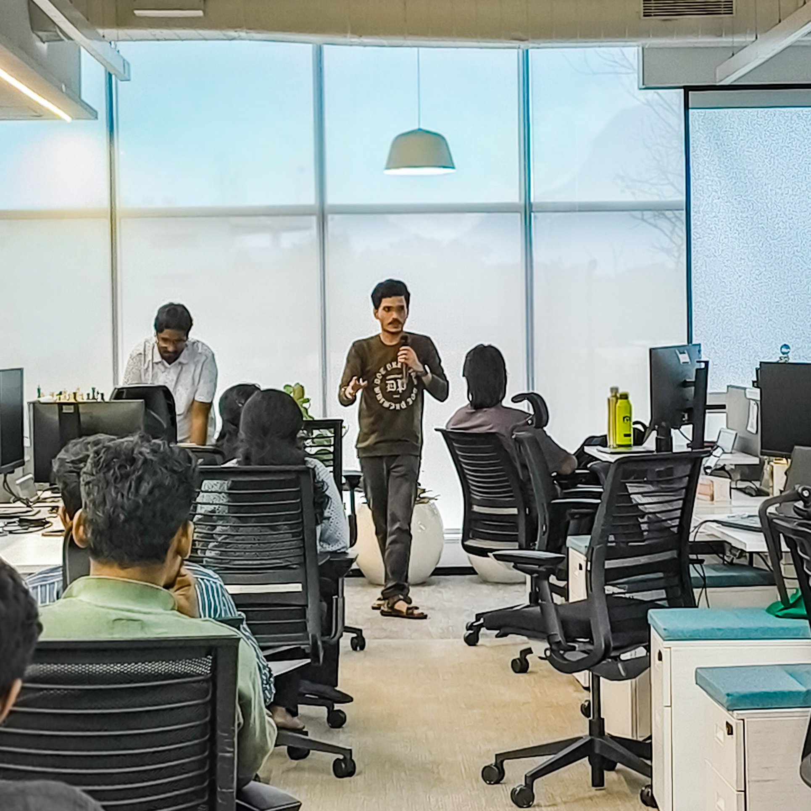
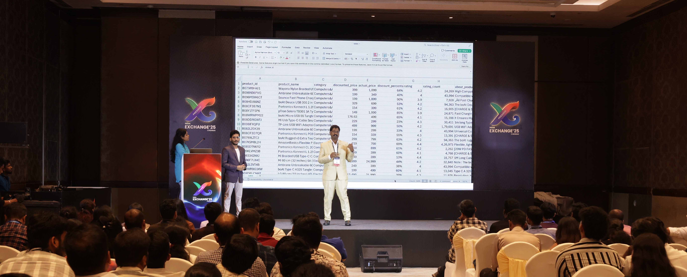
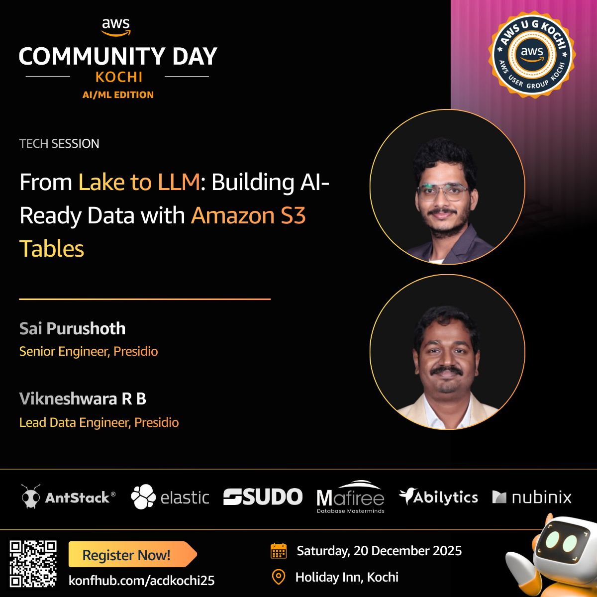
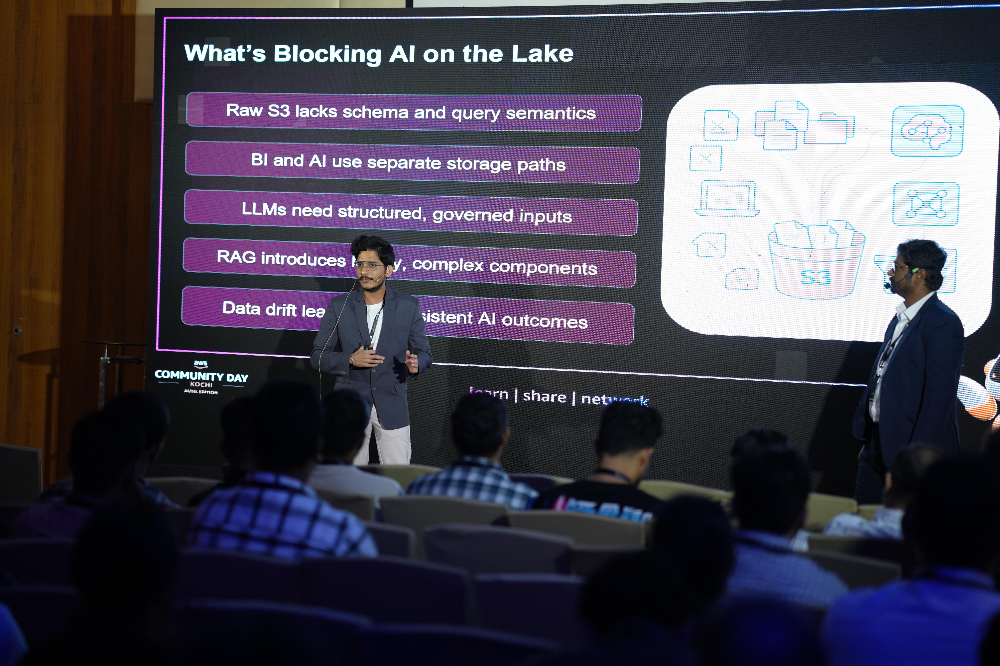

## Hi there 👋 I am Sai Purushoth,

Senior Data Engineer | AWS & Databricks Certified | Python | PySpark | Spark | SQL | Apache Iceberg | Delta Lake | Snowflake

👋 Working Professional with over 3+ years of experience with a passion for cloud computing, data engineering, and building AI-powered solutions.
🚀 I specialize in designing scalable data architectures, optimizing ETL pipelines, and building robust data solutions using tools like AWS Glue, Spark, Snowflake, and Databricks.
🌟 My expertise includes leveraging AWS services, fine-tuning data workflows, and implementing data quality assessments in modern data platforms.
🎤 I've delivered impactful data engineering solutions, automated infrastructure deployments, and have exposure to building GenAI applications on AWS.
📈 Constantly learning and sharing knowledge, I aim to create impactful solutions that bridge technology and business needs.
💬 Ask me about AWS Data Engineering, GenAI on AWS, Spark & PySpark, Apache Iceberg, Snowflake, Databricks, and Real-time Streaming

## 🎓 Certifications

## 🎤 Speaking & Community Engagement

### Snowflake User Group - Coimbatore (October 2024)
**Topic:** Apache Iceberg - Core Concepts & Best Practices

Shared insights on Apache Iceberg covering core concepts and best practices from hands-on project experience. Discussed how Iceberg integrates with modern data platforms like Snowflake to build scalable, governed data lakes.

---

### Presidio India Exchange 2025 (November 2024)
**Topic:** Modernizing Data Transformation Pipelines on AWS: From Complexity to Clarity

Presented a tech talk on modernizing data transformation pipelines on AWS, focusing on bringing clarity and automation into data engineering workflows using cloud-native patterns, Airflow, and dbt.

📝 **Session Article:** [Read the full recap on Medium](https://lnkd.in/gdG7BuTf)

---

### AWS Community Day Kochi 2025 (December 2024)
**Topic:** From Lake to LLM: Building AI-Ready Data with Amazon S3 Tables

Presented on how Amazon S3 Tables help build scalable, AI-ready data foundations for modern GenAI workloads, discussing strategies for preparing data lakes for LLM applications.

🎥 **Session Recording:** [Watch on YouTube](https://lnkd.in/gcmdkCu9)

---

## ✍️ Technical Writing

### Towards AWS Blog Posts

📝 **[Setting Up Change Data Capture (CDC) for MySQL with AWS DMS, Kinesis, and Delta Lake](https://medium.com/towards-aws/setting-up-change-data-capture-cdc-for-mysql-with-aws-dms-kinesis-and-delta-lake-9b8c49d90047)**

A comprehensive guide on implementing CDC pipelines using AWS services for real-time data synchronization.

📝 **[Turning Retail Data into AI Intelligence with Amazon S3 Tables and Claude MCP](https://medium.com/towards-aws/turning-retail-data-into-ai-intelligence-with-amazon-s3-tables-and-claude-mcp-ebaf7c08dbd1)**

Exploring how to build AI-ready data foundations using Amazon S3 Tables and leverage them for GenAI workloads.

---

## 📱 Connect & Latest Updates

### LinkedIn Posts (2025)

🔗 **[2025: A Year of Learning & Growth](https://www.linkedin.com/posts/sai-purushoth-0642871b7_%F0%9D%9F%AE%F0%9D%9F%AC%F0%9D%9F%AE%F0%9D%9F%B1-%F0%9D%97%94-%F0%9D%97%AC%F0%9D%97%B2%F0%9D%97%AE%F0%9D%97%BF-%F0%9D%97%BC%F0%9D%97%B3-%F0%9D%97%9F%F0%9D%97%B2%F0%9D%97%AE%F0%9D%97%BF%F0%9D%97%BB%F0%9D%97%B6%F0%9D%97%BB%F0%9D%97%B4-activity-7412009634590470144-4Wyj)**
Year-end reflection covering certifications, GenAI hackathons, speaking engagements, training sessions, and community contributions throughout 2025.

🔗 **[AWS Community Day Kochi 2025](https://www.linkedin.com/posts/sai-purushoth-0642871b7_awscommunityday-awscommunity-amazons3-activity-7409887295480332289-8B3V)**
Presented on building AI-ready data foundations with Amazon S3 Tables.

🔗 **[Presidio India Exchange 2025](https://www.linkedin.com/posts/sai-purushoth-0642871b7_indiaexchange2025-activity-7396220562571812864-F7Qg)**
Tech talk on modernizing data transformation pipelines on AWS.

🔗 **[Snowflake User Group - Coimbatore](https://www.linkedin.com/posts/sai-purushoth-0642871b7_snowflake-aiandanalytics-technicalcommunityevent-activity-7383041306467635200-GGFE)**
Session on Apache Iceberg at the inaugural Snowflake User Group meetup.

---

## 📫 Connect With Me

---
